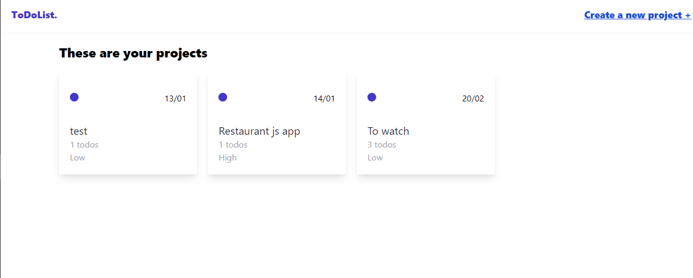

# to-do-list

A todo list app built with javascript vanilla
## Screenshots



## Built With 🔨
- Javascript
- Html
- Webpack


## Live Demo 🚀
[TODO](https://rahalrazika.github.io/to-do-list/)

## Getting Started 💻

## Installation

To get a local copy of the repository please run the following commands on your terminal:

```
$ cd <folder>
```

```
$ git clone git@github.com:rahalrazika/to-do-list.git
```


## Authors
👤 **Diego Lira**

- Github: [@Diego Lira](https://github.com/lirad)
- Linkedin : [Diego Lira](https://www.linkedin.com/in/diegoalira/)

👤 **Razika Rahal**

- Github: [@rahalrazika](https://github.com/rahalrazika)
- Linkedin : [Razika Rahal](https://www.linkedin.com/in/razika-rahal-85539bbb/)
- Twitter: [@Razika Rahal](https://twitter.com/RahalRazika)


## 🤝 Contributing

Contributions, issues and feature requests are welcome!

## Show your support

Give a ⭐️ if you like this project!

## Acknowledgments

-  Odin projects
-  Microverse